# Real-Time Distributed Online Auction System 🚀

A high-concurrency, distributed auction platform built with **Java EE**. This system is engineered to handle real-time simultaneous bidding from multiple users without data conflicts, utilizing **Enterprise JavaBeans (EJB)**, **JMS**, and **WebSockets**.

## 🎥 Demo
**[▶️ Click here to watch the system in action](/demo/demo.mp4)**
*(Simulating high-concurrency bidding with JMeter and real-time updates)*

---

## 🏗 High-Concurrency Architecture Flow
The following diagram illustrates how the system handles simultaneous bids using **Container-Managed Concurrency** and **Asynchronous Messaging**.

```mermaid
%%{init: {'theme':'base', 'themeVariables': { 'primaryColor':'#e3f2fd','primaryTextColor':'#000','primaryBorderColor':'#1976d2','lineColor':'#1976d2','secondaryColor':'#fff3e0','tertiaryColor':'#f3e5f5','noteBkgColor':'#fff9c4','noteTextColor':'#000','noteBorderColor':'#f57f17','actorBkg':'#ffffff','actorBorder':'#1976d2','actorTextColor':'#000','actorLineColor':'#1976d2','signalColor':'#000','signalTextColor':'#000','labelBoxBkgColor':'#ffffff','labelBoxBorderColor':'#1976d2','labelTextColor':'#000','loopTextColor':'#000','activationBorderColor':'#1976d2','activationBkgColor':'#ffffff','sequenceNumberColor':'#000','background':'#ffffff','mainBkg':'#ffffff','textColor':'#000'}}}%%
sequenceDiagram
    autonumber
    
    box Client Side
        actor User1 as 👤 User 1
        actor User2 as 👤 User 2
        participant UI as 🖥️ Web UI<br/>(All Clients)
    end
    
    box Web Layer
        participant Servlet as 📡 Servlet Container<br/>(HTTP Handler)
    end
    
    box EJB Business Layer
        participant BidMgr as 🎯 BidManager<br/>(Stateless EJB)
        participant BidMap as 🔐 BidMap<br/>(Singleton EJB)<br/>⚡ Shared Memory
    end
    
    box Async Messaging Layer
        participant JMS as 📨 JMS Topic<br/>(Message Queue)
        participant MDB as 🔄 Message Listener<br/>(MDB Consumer)
    end

    Note over User1,User2: 🚀 CONCURRENT BID SUBMISSION
    
    par User 1 submits bid
        User1->>+Servlet: POST /bid (amount: $100)
        Servlet->>+BidMgr: placeBid(auctionId, bidDetails)
        BidMgr->>+BidMap: saveBid(auctionId, bid)
        
        rect rgb(255, 240, 200)
            Note right of BidMap: ⚠️ CRITICAL SECTION<br/>🔒 @Lock(WRITE) Applied<br/>Thread-Safe Write Operation<br/>Only ONE thread at a time
            BidMap->>BidMap: Validate & Store Bid
        end
        
        BidMap-->>-BidMgr: ✅ Bid Saved
        BidMgr-->>-Servlet: Success Response
        Servlet-->>-User1: 200 OK (Bid Accepted)
        
        BidMap->>+JMS: publish(bidEvent)
        Note right of JMS: 🚀 Async - Non-Blocking<br/>User Already Got Response
        JMS-->>-BidMap: Message Queued
    and User 2 submits bid (simultaneously)
        User2->>+Servlet: POST /bid (amount: $105)
        Servlet->>+BidMgr: placeBid(auctionId, bidDetails)
        BidMgr->>+BidMap: saveBid(auctionId, bid)
        
        rect rgb(255, 240, 200)
            Note right of BidMap: ⏳ WAITING for Lock<br/>User 1's write must complete first
            BidMap->>BidMap: Validate & Store Bid
        end
        
        BidMap-->>-BidMgr: ✅ Bid Saved
        BidMgr-->>-Servlet: Success Response
        Servlet-->>-User2: 200 OK (Bid Accepted)
        
        BidMap->>+JMS: publish(bidEvent)
        JMS-->>-BidMap: Message Queued
    end

    Note over JMS,MDB: 📡 REAL-TIME BROADCAST TO ALL CLIENTS

    JMS->>+MDB: onMessage(bidEvent)
    MDB->>+UI: WebSocket Push:<br/>{"type":"NEW_BID", "amount":"$100", "user":"User1"}
    UI->>UI: 🔄 Update Auction UI<br/>(All Connected Clients)
    MDB-->>-JMS: Message Processed
    
    JMS->>+MDB: onMessage(bidEvent)
    MDB->>+UI: WebSocket Push:<br/>{"type":"NEW_BID", "amount":"$105", "user":"User2"}
    UI->>UI: 🔄 Update Auction UI<br/>(All Connected Clients)
    MDB-->>-JMS: Message Processed

    Note over User1,UI: ✅ System Maintains Data Integrity<br/>🚀 Zero UI Blocking<br/>⚡ Sub-Second Updates to All Users
```

---

## 🏛 Architectural Decisions: Why No Database?

You might notice this project uses **In-Memory Storage** (`ConcurrentHashMap`) instead of a traditional relational database. This was a deliberate architectural choice.

The primary goal of this engineering project was to demonstrate deep knowledge of **concurrency control** and **state management** at the application layer. By managing state in memory:

- I implemented strict **Container-Managed Concurrency** manually using Singleton EJBs.
- I utilized explicit **Read/Write Locking** strategies (`@Lock(LockType.WRITE)`) to prevent race conditions during simultaneous bids.
- This approach isolates the study of **thread safety mechanisms** in Java EE without offloading locking responsibility to a database engine.

---

## ✨ Key Features

- **Real-Time Push Notifications**: Uses JMS (Java Message Service) and Message-Driven Beans (MDB) to decouple bid processing from user notifications. Updates are pushed to clients via WebSockets instantly.

- **Thread-Safe Bidding**: A `@Singleton` BidMapBean manages the shared state of all auctions, ensuring data consistency even when hundreds of users bid at the exact same millisecond.

- **Automatic Auction Lifecycle**: Utilizes `ScheduledExecutorService` to automatically close auctions when time expires and notify all connected clients.

- **Scalable Design**: Separates business logic (Stateless Beans) from shared state (Singleton Beans) to optimize performance.

---

## ⚙️ Configuration & Performance Tuning

To achieve high concurrency (tested with JMeter load tests), the GlassFish Server thread pools must be tuned beyond default settings to handle thousands of concurrent requests.

### 1. EJB Container Settings

- **Initial & Min Pool Size**: 200
- **Max Pool Size**: 3000
- **Pool Idle Timeout**: 60 Seconds

### 2. JMS Connection Factory

- **Initial & Min Pool Size**: 50
- **Max Pool Size**: 500
- **Max Wait Time**: 30000 Milliseconds

### 3. Web Container (Thread Pool)

- **Max Queue Size**: 10000
- **Max Thread Pool Size**: 3000
- **Min Thread Pool Size**: 200

---

## 🚀 Getting Started

### Prerequisites
- JDK 8 or higher
- GlassFish Server / Payara Server
- NetBeans or IntelliJ IDEA

### Installation
1. Clone the repository.
2. Open the project in your IDE.
3. Configure your GlassFish server with the Pool Settings listed above for best performance.
4. Build and Run the project (Deploy the EAR/WAR).

---

## 🔐 Accessing the Admin Panel

To test the administrative features (creating auctions, managing users), use the following credentials:

- **Username**: `admin`
- **Password**: `1234`

---

## 🛠 Technology Stack

- **Backend**: Java EE (EJB 3.x, JMS, Servlets)
- **Middleware**: GlassFish Server
- **Concurrency**: Java Concurrency API (ConcurrentHashMap, Locks)
- **Frontend**: JSP, WebSocket API
- **Testing**: Apache JMeter (Load Testing)

---

## 📄 License

This project is licensed under the MIT License - see the LICENSE file for details.